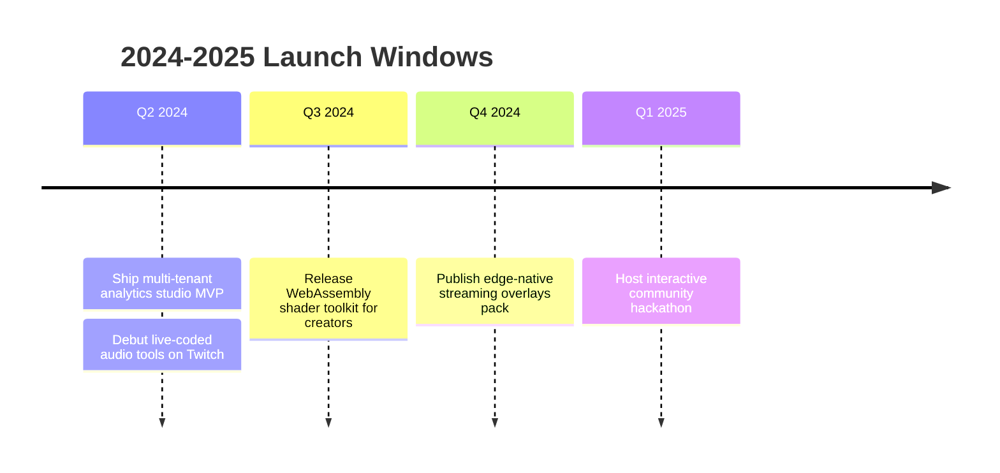

<!-- Minimalist motion-forward profile README -->

  

  

Full-stack engineer orchestrating immersive experiences across web, systems, and audio.

  
  
  
  
  

  
  
  

  <a href="#now-shipping">Now</a> ·
  <a href="#signal-ticker">Ticker</a> ·
  <a href="#launch-bay">Launch&nbsp;Bay</a> ·
  <a href="#signals">Signals</a> ·
  <a href="#motion-lab">Motion&nbsp;Lab</a> ·
  <a href="#trajectory">Trajectory</a> ·
  <a href="#open-studio">Studio</a> ·
  <a href="#resonance">Resonance</a>

  

<b>Now Shipping</b> — what’s in motion this week

- 🚀 Shipping data-rich dashboards with Next.js, tRPC, and edge runtimes.
- 🧠 Exploring low-level performance patterns in Rust and WebAssembly.
- 🎧 Composing generative soundscapes for live streaming overlays.

  

  

<b>Signal Ticker</b> — pulse updates & live vibes

  

  
  
  

<b>Build Playbook</b> — where I create the most value

| Product Flow | Systems Thinking | Creative Tech |
| --- | --- | --- |
| • Craft accessible, story-driven UX at high velocity. • Run tight design loops with component sandboxes. | • Architect event-driven services with observability from day one. • Automate delivery across cloud and edge surfaces. | • Blend GLSL/Three.js shaders with Web Audio for immersive visuals. • Prototype interactive installations and stream overlays. |

<b>Toolbox</b> — favourite stack & instruments

  

  

  

  

<b>Launch Bay</b> — interactive builds on display

  
  

  
  

<b>Signals</b> — open dev metrics

  

  

  <picture>
    <source media="(prefers-color-scheme: dark)" srcset="https://github-readme-activity-graph.vercel.app/graph?username=germanProgq&bg_color=0D1117&color=8A5CF6&line=F97316&point=8A5CF6&hide_border=true">
    <source media="(prefers-color-scheme: light)" srcset="https://github-readme-activity-graph.vercel.app/graph?username=germanProgq&bg_color=FFFFFF&color=8A5CF6&line=F97316&point=8A5CF6&hide_border=true">
    
  </picture>

  

  
  

<b>Signal Strength</b> — how I split my creative energy

<table>
  <tr>
    <td>Systems design</td>
    <td><progress value="90" max="100"></progress></td>
  </tr>
  <tr>
    <td>Interactive web</td>
    <td><progress value="85" max="100"></progress></td>
  </tr>
  <tr>
    <td>AI-assisted tooling</td>
    <td><progress value="80" max="100"></progress></td>
  </tr>
  <tr>
    <td>Audio & visuals</td>
    <td><progress value="75" max="100"></progress></td>
  </tr>
</table>

<b>Motion Lab</b> — audio + visual experiments

  

  

<b>Trajectory</b> — upcoming launch timeline

<b>Achievements</b> — open source trophies & badges

  

<b>Daily Byte</b> — random dev humor

  

<b>Open Studio</b> — extras & inspiration

  <a href="https://skyline.github.com/germanProgq/2023" target="_blank">Interactive GitHub Skyline</a> ·
  <a href="https://skyline.github.com/germanProgq/2024" target="_blank">2024 in progress</a>

  

  <picture>
    <source media="(prefers-color-scheme: dark)" srcset="https://raw.githubusercontent.com/platane/platane/output/github-contribution-grid-snake-dark.svg">
    <source media="(prefers-color-scheme: light)" srcset="https://raw.githubusercontent.com/platane/platane/output/github-contribution-grid-snake.svg">
    
  </picture>

<b>Resonance</b> — soundtrack & downtime loops

  

  

  <strong>Let’s build something timeless.</strong> 
  <a href="mailto:gvniok@duck.com">gvniok@duck.com</a> · <a href="https://discord.gg/eeh_">Discord</a>

  

