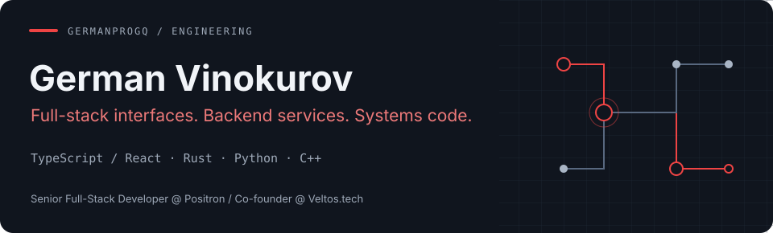
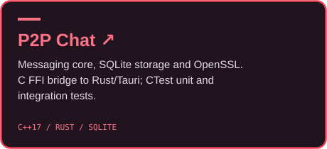
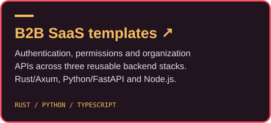
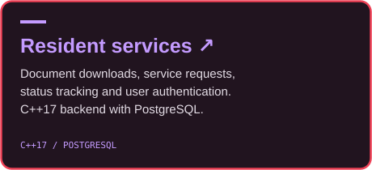
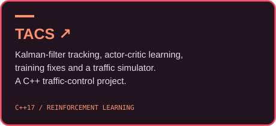
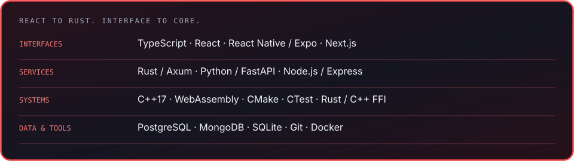
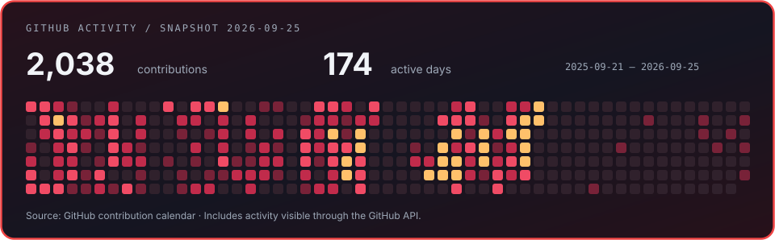

  

  
  
  
  

I work across **interfaces, services, and systems code**—from React user portals to Rust backends and C++ WebAssembly modules.

**Positron · Senior Full-Stack Developer**  
Rebuilding a legacy 1C-Bitrix user portal with **TypeScript, React Native / Expo, WebAssembly, and Rust**. Improving automation and moving paper-based workflows into software.

**[Veltos.tech](https://veltos.tech) · Co-founder & co-owner**  
Co-founded and run a digital product development company, started in August 2026.

**[StarsVPN](https://starsafeconnect.com) · Creator**  
Work on the React/TypeScript dashboard and Rust node setup and configuration.

<strong>More about my engineering background</strong>

- **Ayuniqa:** Node.js/MongoDB services, React dashboards, and C++ WebAssembly modules for loading, animations, and request handling.
- **Pando Electric:** Python services and APIs for EV charging, access control, billing events, and reporting.
- **Confidential contract:** maintenance and bug fixes in legacy Rust/C++ codebases for crypto market making.
- **Earlier work:** industrial automation with PLCs and sensors; machine-learning project work including graph-based delivery optimization.
- **Education:** B.Sc. in Computer Programming at NUST MISIS, in progress; expected 2027.

Snapshot dated September 25, 2026. [Live activity](https://github.com/germanProgq?tab=overview) · [Graphic source](scripts/render_profile.py)

Open to **full-stack, backend, and C++/Rust** development opportunities. Explore the code above, visit my [portfolio](https://germanprogq.github.io/portfolio/), or reach me at **[gvinok@duck.com](mailto:gvinok@duck.com)**.

