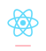
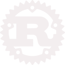

   &nbsp;
   &nbsp;
   &nbsp;
   &nbsp;
   &nbsp;

Senior Full-Stack Developer at **Positron** · Co-founder of **[Veltos.tech](https://veltos.tech)** · Creator of **[StarsVPN](https://starsafeconnect.com)**

[Portfolio](https://germanprogq.github.io/portfolio/) &nbsp; / &nbsp; [LinkedIn](https://linkedin.com/in/german-vinokurov-300b26320) &nbsp; / &nbsp; [Email](mailto:gvinok@duck.com) &nbsp; / &nbsp; [X](https://x.com/GermanVinokurov)
